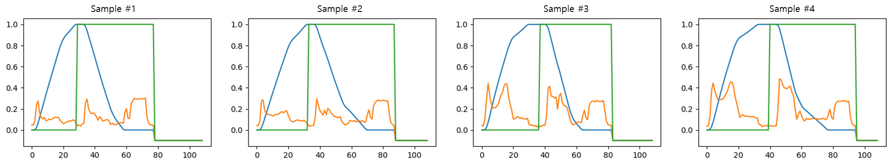
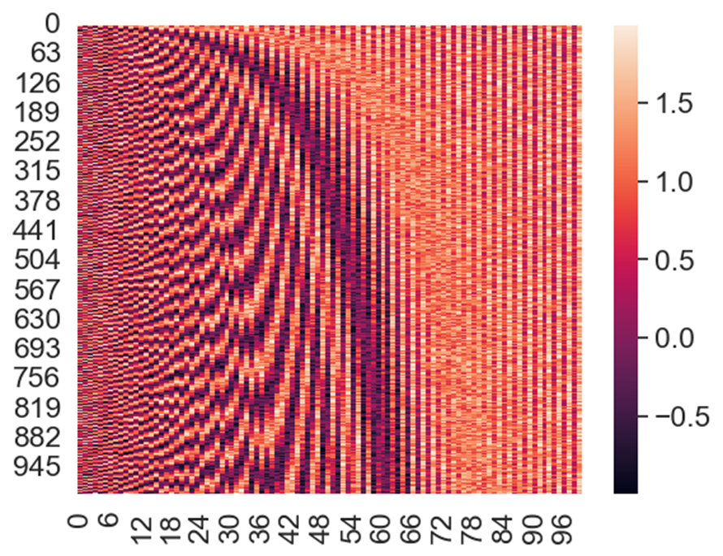
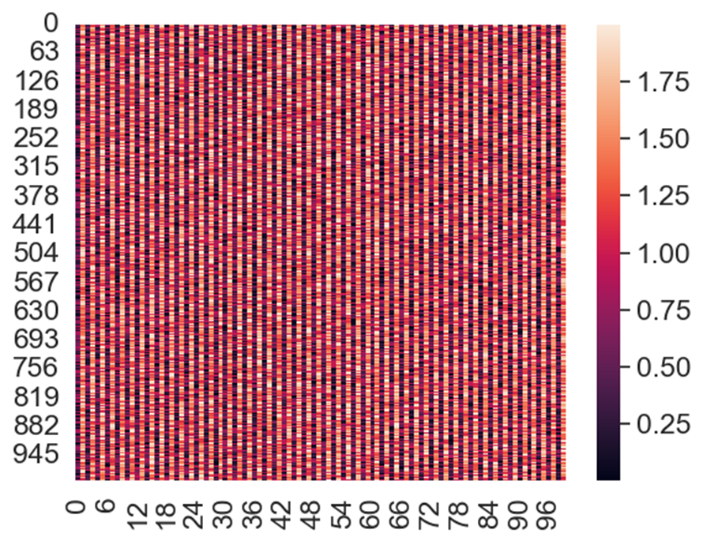

# 들어가기 앞서

본 포스트에서는 Transformer Encoder와 Decoder로 간단한 Variational Auto-encoder (VAE) 모델을 만들어 시계열 데이터를 생성해보려고 합니다.
구현에는 Pytorch를 사용합니다.

# 데이터

학습 데이터는 *전기식 출입문 테스트베드*에서 취득한 다변량 시계열 데이터로 3개 변수를 가지고 있습니다. 훈련/검증 샘플 개수는 1,798/772개이고 모든 샘플의 길이는 109로 동일합니다.

아래는 데이터 예시로, 랜덤하게 뽑은 4개 샘플입니다.



위 시계열 데이터를 재구성하는 것에 대한 의미는 특별히 없습니다. 다만 Transformer-VAE 실습 예시로 적절한 것 같아 가져왔습니다.

데이터 세부사항은 이하 Dataset, DataLoader 구현 파트에서 다룹니다.

# 이론

구현을 위해서는 Transformer와 VAE에 대한 배경지식이 필요합니다. 이 두 가지 개념을 정말 친절하고 자세하게 설명하는 글이 이미 많기에 여기서는 생략하도록 하겠습니다.

아래는 제가 스터디할 때 많은 도움을 받았던 링크입니다.

Transformer: [딥 러닝을 이용한 자연어 처리 입문](https://wikidocs.net/31379)

VAE: [Variational Autoencoder - VISUALLY EXPLAINED!](https://youtu.be/h9kWaQQloPk)

# 구현

Transformer-VAE 모델을 구현하기에 앞서, 우선 필요한 함수들을 먼저 정의합니다.

## Dataset

```python
# 데이터 로딩 클래스 정의
class TransformerDataset(Dataset):
    def __init__(self, file_path, file_name, seq_len=None):
        """
        Args:
            file_path (string): 데이터 경로.
            file_name (string): 데이터 파일 이름.
            seq_len (int): 시퀀스 길이.
        """
        self.data = np.load(file_path + file_name, allow_pickle=True)
        if seq_len == None:
            seq_len = max([len(seq) for seq, _ in self.data])
        self.seq_len = seq_len
    
    def __len__(self):
        return len(self.data)

    def __getitem__(self, idx):
        pad_feature = np.ones((self.seq_len, 3)) * -0.1
        pad_feature[:len(self.data[idx][0])] = np.array(self.data[idx][0])
        
        return pad_feature
```

`torch.utils.data.Dataset`을 상속받아 `TransformerDataset`을 정의했습니다.

우선 샘플에 모두 -0.1로 padding을 적용했습니다. Transformer는 RNN 계열으로 입력 시퀀스 길이를 반드시 맞춰주어야 하는 것은 아니지만, batch 연산을 위해 padding으로 모든 샘플의 길이를 맞춰주었습니다. 본래 `pad_sequence`나 `pack_sequence`를 사용하는 것이 맞지만, 학습 데이터셋이 크지 않기에 코드 구현의 편의를 위해 가장 시퀀스 길이가 긴 샘플의 길이에 맞췄습니다.   
(padding value는 무엇으로 설정하든 이번 실습에서는 큰 차이가 없었습니다.)


## Positional Encoding

```python
class PositionalEncoding(nn.Module):
    def __init__(self, d_model: int, dropout: float = 0.1, max_len: int = 5000, batch_first: bool = False):
        super().__init__()
        self.dropout = nn.Dropout(p=dropout)
        self.batch_first = batch_first

        position = torch.arange(max_len).unsqueeze(1)
        div_term = torch.exp(torch.arange(0, d_model, 2) * (-math.log(10000.0) / d_model))
        pe = torch.zeros(max_len, d_model)
        pe[:, 0::2] = torch.sin(position * div_term)
        pe[:, 1::2] = torch.cos(position * div_term)
        pe = pe.unsqueeze(0)  # Shape [1, max_len, d_model]
        self.register_buffer('pe', pe)

    def forward(self, x: torch.Tensor) -> torch.Tensor:
        """
        Arguments:
            x: Tensor, shape ``[seq_len, batch_size, embedding_dim]`` if batch_first=False
                             ``[batch_size, seq_len, embedding_dim]`` if batch_first=True
        """
        if self.batch_first:
            x = x + self.pe[:, :x.size(1)]
        else:
            x = x + self.pe[:, :x.size(0)].transpose(0, 1)
        return self.dropout(x)
```

Transformer 모델 input 단계에서 필요한 PositionalEncoding 모듈을 구현합니다. 익히 알려져 있듯, Transformer는 모든 시계열 데이터를 처음부터 끝까지 한번에 입력받기 때문에 각 데이터 포인트가 어느 시점에 해당하는지에 대한 정보를 따로 제공해주어야 합니다. PositionalEncoding 모듈은 각각의 시계열 데이터 포인트에 다른 값들을 더해줘서 해당 포인트가 어느 시점인지 모델이 알 수 있도록 합니다.

한가지 유의할 점은 `forward()` 부분의 `if self.batch_first` 구문인데요, 현재 `input.shape`가 `(seq_len, batch_size, embedding_dim)`이냐 `(batch_size, seq_len, embedding_dim)`이냐에 따라, 즉 SBF냐 BSF이냐에 따라 출력 방식을 바꿔주어야 합니다. 그렇지 않으면 PositionalEncoding이 제대로 되지 않습니다.

* 정상적으로 구현된 케이스)   
`batch_first=False`일 때 데이터를 *SBF* 형태로 입력해주면
    ```python
    pos_encoder = PositionalEncoding(d_model=100, dropout=0, batch_first=False)
    a = torch.rand(1000, 1, 100) # SBF
    sns.heatmap(pos_encoder(a).squeeze())
    ```


* 잘못 구현된 케이스)   
`batch_first=False`일 때 데이터를 *BSF* 형태로 입력해주면
    ```python
    pos_encoder = PositionalEncoding(d_model=100, dropout=0, batch_first=False)
    a = torch.rand(1, 1000, 100) # BSF
    sns.heatmap(pos_encoder(a).squeeze())
    ```


## Transformer-VAE model

이제 `torch.nn.Module`을 사용하여 Transformer-VAE 모델을 구현합니다.

```python
class TVAE(torch.nn.Module):

    def __init__(self, n_feature, d_model, nhead, num_layers, hidden_dim):
        super().__init__()
        
        self.pos_encoder = PositionalEncoding(d_model=d_model, dropout=0.5, batch_first=True)

        self.seq_embedding = nn.Linear(n_feature, d_model)
        encoder_layers = nn.TransformerEncoderLayer(d_model=d_model, nhead=nhead, dropout=0.5, batch_first=True)
        self.transformer_encoder = nn.TransformerEncoder(encoder_layers, num_layers=num_layers)

        self.z_mean = nn.Linear(d_model, hidden_dim)
        self.z_log_var = nn.Linear(d_model, hidden_dim)
        self.z_embedding = nn.Linear(hidden_dim, d_model)
        
        decoder_layers = nn.TransformerDecoderLayer(d_model=d_model, nhead=nhead, dropout=0.5, batch_first=True)
        self.transformer_decoder = nn.TransformerDecoder(decoder_layers, num_layers=num_layers)
        self.predictor = nn.Linear(d_model, n_feature)
    
    def get_mask(self, sz):
        mask = (torch.triu(torch.ones(sz, sz)) == 1).transpose(0, 1)
        mask = mask.float().masked_fill(mask == 0, float('-inf')).masked_fill(mask == 1, float(0.0))
        return mask

    def reparameterize(self, z_mean, z_log_var):
        eps = torch.randn_like(z_mean)
        z = z_mean + eps * torch.exp(z_log_var/2.) 
        return z
    
    def forward(self, src, tgt=None, src_key_padding_mask=None, tgt_key_padding_mask=None): # seq shape: (batch_size, seq_len, feature_dim)
        self.batch_size = src.shape[0]
        self.seq_len = src.shape[1]
        self.n_feature = src.shape[2]
        
        src = self.seq_embedding(src)
        src = self.pos_encoder(src)
        src = self.transformer_encoder(src, src_key_padding_mask)
        src = src.mean(1).squeeze()
        z_mean, z_log_var = self.z_mean(src), self.z_log_var(src)
        z = self.reparameterize(z_mean, z_log_var)
        src = self.z_embedding(z)
        src = src.unsqueeze(1)
        src = src.repeat(1, self.seq_len, 1)
        if self.training:
            tgt = tgt[:, :-1, :]
            tgt = torch.cat([torch.zeros(self.batch_size, 1, self.n_feature).float().to(DEVICE), tgt], dim=1)
            tgt = self.seq_embedding(tgt)
            tgt = self.pos_encoder(tgt)
            tgt_mask = self.get_mask(tgt.size(1)).to(DEVICE)

            tgt = self.transformer_decoder(
                tgt = tgt, 
                memory = src, 
                tgt_mask = tgt_mask, # to avoid looking at the future tokens (the ones on the right)
                tgt_key_padding_mask = tgt_key_padding_mask, # to avoid working on padding
                memory_key_padding_mask = src_key_padding_mask # avoid looking on padding of the src
            )

            recon_seq = self.predictor(tgt)

        else:
            with torch.no_grad():
                recon_seq = torch.zeros(self.batch_size, 1, self.n_feature).float().to(DEVICE)
                
                for t in range(self.seq_len):
                    embed_recon_seq = self.seq_embedding(recon_seq)
                    embed_recon_seq = self.pos_encoder(embed_recon_seq)
                    recon_seq_mask = self.get_mask(recon_seq.size(1)).to(DEVICE)

                    output = self.transformer_decoder(
                        tgt=embed_recon_seq, 
                        memory=src, 
                        tgt_mask=recon_seq_mask,
                    )
                    output = output[:, -1, :]
                    output = self.predictor(output)
                    output = output.unsqueeze(1)
                    recon_seq = torch.cat([recon_seq, output], dim=1)

                recon_seq = recon_seq[:, 1:, :]
                
        return recon_seq, z_mean, z_log_var
```