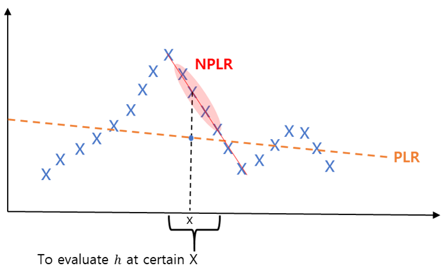
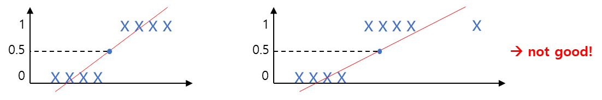
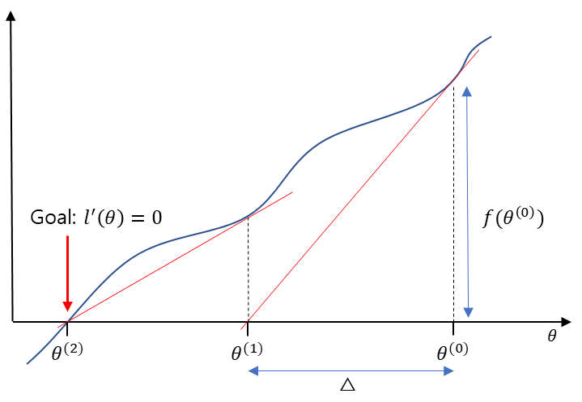

# 들어가기 앞서

본 시리즈의 목적은 CS229 강의 내용을 그대로 담아서 필자의 장기기억 저장소에 업로드하기 위함이므로,
강의 내용을 될 수 있는 한 그대로 따라가려고 합니다.
그래서 강의 흐름에 따라 강의자가 한 대사와 판서 내용을 그대로 적으려고 했습니다.
다만 흐름이 매끄럽지 못하거나 추가 설명이 필요하다 생각되는 부분은 필자가 강의자의 대사를 인용해서,
혹은 필자 나름대로의 생각을 추가하였습니다.
포스팅에서 강의 내용과 필자의 생각을 따로 구분하지는 않고 있으니, 이 점 염두에 두시고 읽어주시면 감사하겠습니다.

# Locally weighted regression

학습 알고리즘에는 2가지 종류가 있습니다.

1. Parametric Logistic Regrsssion (PLR)  
이 알고리즘은 고정된 파라미터 세트 $\theta_i$를 데이터에 fitting합니다.
모델을 보관하기 위해서는 파라미터 $\theta$를 저장해야 합니다.

2. Non-Parametric Logistic Regression (NPLR)  
저장해야될 데이터와 파라미터가 학습 데이터 크기에 비례하여 증가합니다.
모델을 보관하기 위해서는 모든 데이터를 저장해야 합니다.

아래는 PLR과 NPLR의 차이를 직관적으로 나타내는 그림입니다.
이 데이터에 PLR을 fitting하면 loss가 상대적으로 클 것입니다.
하지만 NPLR을 fitting하면 loss가 작을 것입니다.

이제 PLR과 NPLR에 대한 수식들을 보겠습니다.

### Linear Regression (선형회귀)

아래 수식을 최소화하는 $\theta$를 찾습니다.

$$
\frac{1}{2}\sum_{i}(y^{(i)}-\theta^ix^{(i)})^2
$$

예측값으로 $\theta^Tx$를 반환합니다.

### Locally Weighted Regression

아래 수식을 최소화하는 $\theta$를 찾습니다.

$$
\sum^{m}_{i=1}w^{(i)}(y^{(i)}-\theta^Tx^{(i)})^2
$$

여기서 $x$는 예측하고 싶은 위치를 나타내고,  
$w^i$는 가우시안 형태를 갖는 가중치(weight) 함수를 나타냅니다.

$$
w^{(i)}=\exp{\left(-\frac{(x^{(i)}-x)^2}{2\tau^2}\right)}
$$

이렇게 가중치 함수를 사용하면, 우리가 예측하고 싶은 $x$ 근처에 있는 오차들만을 더할 수 있습니다.

즉, 예측하고 싶은 포인트 주변에만 관심을 갖겠다는 것이죠.

# 왜 Mean Sqaured Error를 사용하는가?

이게 바로 이번 lecture 3의 주제입니다.

Q: 왜 우리는 오차$^2$를 사용하는걸까요? 오차$^3$, 오차$^4$는 안되나요?  
A: 그것은 바로 최대우도법(the principal of maximum likelihood)에 따른 결과입니다.

우선 간단한 선형회귀 모델을 가정하겠습니다.

Assume 1)

$$
y^{(i)}=\theta^Tx^{(i)}+\epsilon^{(i)}
$$

여기서 $\theta^Tx^{(i)}$는 예측모델이고 $\epsilon^{(i)}$은 모델링되지 않은 효과들과 랜덤 노이즈들을 포함하는 "오차"항 입니다.

Assume 2)  
만약 $\epsilon^{(i)}$이 독립항등분포(independently and identically distributed, i.i.d.)이고,  
평균 0, 분산 $e^2$를 갖는 정규분포 $\mathcal{N}(0, e^2)$를 따른다면,

$\epsilon^{(i)}$의 확률밀도함수(probability density function)는 아래와 같이 주어집니다.

$$
p(e^{(i)})=\frac{1}{\sigma\sqrt{2\pi}}\exp{\left(-\frac{(e^{(i)})^2}{2\sigma^2}\right)}
$$

그러면 $y^{(i)}=\theta^Tx^{(i)}+\epsilon^{(i)}$이므로, $y^{(i)}$를 $x^{(i)}$에 대한 조건부확률분포로 나타낼 수 있습니다.

$$
p(y^{(i)}|x^{(i)};\theta)=\exp{\left(-\frac{(y^{(i)}-\theta^Tx^{(i)})^2}{2\sigma^2}\right)}
$$

그리고 이것은 파라미터 $\theta$의 likelihood와 같습니다. 

$$
L(\theta)=L(\theta;X,\vec{y})=p(\vec{y}|X;\theta)
$$

여기서 $L(\theta;X,\vec{y})$는 고정된 값 $X$, $\vec{y}$에 대한 $\theta$의 likelihood를 의미하고,  
$p(\vec{y}|X;\theta)$는 고정된 값 $\theta$에 의해 parameterized되는 $X$에 대한 $\vec{y}$의 조건부확률분포를 의미합니다.

그리고 $e^{(i)}$는 i.i.d.이므로, $\theta$의 likelihood는 각각 샘플에 대한 곱으로도 표현 가능합니다.

$$
L(\theta)=\prod^{n}_{i=1}p(y^{(i)}|x^{(i)};\theta)=\prod^{n}_{i=1}\frac{1}{\sigma\sqrt{2\pi}}\exp{\left(-\frac{(y^{(i)}-\theta^Tx^{(i)})^2}{2\sigma^2}\right)}
$$

최대우도법에 따라, 우리는 $L(\theta)$를 최대화하는 $\theta$를 찾아야 합니다.

가장 먼저 likelihood에 $\log$를 취해줍니다.
그러면 모든 곱을 합으로 변환할 수 있고, 따라서 유도과정이 보다 간단해집니다.

$$
\begin{align*}
l(\theta)&=\log L(\theta)\\
&=\log \prod^{m}_{i=1}\left[\log \frac{1}{\sigma\sqrt{2\pi}}+\log \exp{\left(-\frac{(y^{(i)}-\theta^Tx^{(i)})^2}{2\sigma^2}\right)}\right]\\
&=m\cdot\log \frac{1}{\sigma\sqrt{2\pi}}+\sum^{m}_{i=1}\left(-\frac{(y^{(i)}-\theta^Tx^{(i)})^2}{2\sigma^2}\right)\\
&=m\cdot\log \frac{1}{\sigma\sqrt{2\pi}}-\frac{1}{\sigma^2}\cdot\frac{1}{2}\sum^{m}_{i=1}\left(y^{(i)}-\theta^Tx^{(i)}\right)^2\\
&=c-\frac{1}{\sigma^2}\cdot J(\theta)
\end{align*}
$$

결과적으로 log likelihood $l(\theta)$를 최대화한다는 것은 곧 $J(\theta)$를 최소화하는 것이 되고, 이 때의 $J(\theta)$는 mean sqaured error입니다.

# Logistic Regression

분류 문제에서, 선형회귀는 좋은 방법이 아닙니다.

위의 좌측 그림의 경우, 선형회귀 모델 예측값이 0.5보다 크냐 작냐를 기준으로 분류한다면 0과 1을 잘 구분할 수 있을 것 같습니다.

하지만 우측 그림의 경우, outlier가 존재하고, 이에 따라 회귀선이 크게 왜곡되어 더 이상 0.5가 좋은 기준이 되어주지 못합니다.

이럴 때는 로지스틱 회귀 방법을 사용합니다.

만약 target이 $h_\theta(x)\in \left[0, 1\right]$ 이기를 원한다면, 모델을 아래와 같이 정의해주면 됩니다.

$$
h_\theta(X)=g(\theta^TX)=\frac{1}{1+e^{-\theta^TX}}
$$

여기서 $g(z)=\frac{1}{1+e^{-z}}$는 "sigmoid" 혹은 "logistic" 함수를 의미합니다.

$y$의 확률은 아래와 같이 정의될 수 있습니다.

$$
\begin{align*}
P(y=1|x;\theta)&=h_\theta(x)\\
P(y=0|x;\theta)&=1-h_\theta(x)\\
y&\in \{0, 1\}\\
P(y|x;\theta)&=h(x)^y(1-h(x))^{1-y}
\end{align*}
$$

Log likelihood는 아래와 같이 정의됩니다.

$$
\begin{align*}
l(\theta)&=\log L(\theta)\\
&=\sum^{m}_{i=1}y^{(i)}\log h_\theta(x^{(i)})+(1-y^{(i)})\log (1-h_\theta(x^{(i)}))
\end{align*}
$$

Likelihood는 가능한 한 커야 하므로, 이제 $l(\theta)$를 최대화하기 위한 $\theta$를 찾아야 합니다.

그 방식은 batch gradient ascent를 사용합니다.

$$
\begin{align*}
\theta_j &:= \theta_j+\frac{\partial}{\partial\theta_j}l(\theta)\\
\theta_j &:= \theta_j+\alpha\sum^{m}_{i=1}\left(y^{(i)}-h_\theta(x^{(i)})\right)x^{(i)}_j
\end{align*}
$$

이전 linear regression에서는 mean squared error $J(\theta)$를 "minimize"했던 것과는 다르게, logistic regression은 log likelihood $l(\theta)$를 "maximize"한다는 것에 유의합니다. 그래서 이름도 batch gradient "ascent"입니다.

또한, logistic regression에는 linear regression의 normal equation같은 것이 없습니다.
Logistic regression에는 항상 batch gradient ascent나 Netwon's method 같은 알고리즘을 사용합니다.

# Newton's method

$l(\theta)$가 최소가 되는 지점을 찾으려면 $l'(\theta)=0$일 때의 $\theta$를 찾으면 됩니다.

만약 $f(\theta)=l'(\theta)$로 나타내면 그 과정은 아래와 같습니다.

우리는 무작위로 정한 $\theta^{(0)}$에서 출발해서 $\theta^{(1)}$를 거쳐 $\theta^{(2)}$로 가고 싶습니다. $\theta^{(2)}$는 $l'(\theta)$가 0이 되는 지점입니다.

$\theta^{(0)}$에서 $\theta^{(1)}$로 가려면 $\Delta$만큼 빼주면 됩니다.

$$
\theta^{(1)}:=\theta^{(0)}-\Delta
$$

그런데 그래프에서도 확인 가능하듯이 $\frac{f(\theta^{(0)})}{\Delta}$는 $f(\theta^{(0)})$지점의 기울기입니다.

$$
f'(\theta^{(0)})=\frac{f(\theta^{(0)})}{\Delta}
$$

따라서 $\Delta$는 아래와 같습니다.

$$
\Delta=\frac{f(\theta^{(0)})}{f'(\theta^{(0)})}
$$

이제 이것을 일반적인 표현으로 정리하면,

$$
\theta^{(t+1)}:=\theta^{(t)}-\frac{f(\theta^{(t)})}{f'(\theta^{(t)})}
$$

결과적으로, Newton's method는 아래와 같이 정의됩니다.

$$
\theta^{(t+1)}:=\theta^{(t)}-\frac{l'(\theta^{(t)})}{l''(\theta^{(t)})}
$$

Newton's method는 아주 빠르게 수렴합니다.
따라서 iteration을 작게 설정해주어야 합니다.

파라미터 수가 아주 많다면, Newton's method는 좋은 방법이 아닙니다.
왜냐하면 그의 제곱 크기에 해당하는 행렬을 다뤄야 하기 때문입니다.

가령 $\theta$가 벡터라면($\theta\in\mathbb{R}^{n+1}$),  
Newton's method 수식은 아래와 같습니다.

$$
\theta^{(t+1)}:=\theta^{(t)}+H^{-1}\nabla_\theta l
$$

이 수식을 풀기 위해서는 $H$를 구해야 하는데,  
$H$는 Hessian 행렬으로써 $\mathbb{R}^{(n+1)\times(n+1)}$의 크기를 갖습니다.

따라서 파라미터 수가 10,000개라면 10,000 $\times$ 10,000 크기의 행렬을,  
파라미터 수가 100,000개라면 100,000 $\times$ 100,000 크기의 행렬을 계산해야만 합니다.