# 들어가기 앞서

본 시리즈의 목적은 CS229 강의 내용을 그대로 담아서 필자의 장기기억 저장소에 업로드하기 위함이므로,
강의 내용을 될 수 있는 한 그대로 따라가려고 합니다.
그래서 강의 흐름에 따라 강의자가 한 대사와 판서 내용을 그대로 적으려고 했습니다.
다만 흐름이 매끄럽지 못하거나 추가 설명이 필요하다 생각되는 부분은 필자가 강의자의 대사를 인용해서,
혹은 필자 나름대로의 생각을 추가하였습니다.
포스팅에서 강의 내용과 필자의 생각을 따로 구분하지는 않고 있으니, 이 점 염두에 두시고 읽어주시면 감사하겠습니다.

# Perceptron

퍼셉트론(perceptron)은 어떠한 신호 $z$가 주어졌을 때 그 값이 임계치(threshold)를 넘으면 1을 출력하고 그렇지 않을 경우에는 0을 출력하는 함수로,
계단 함수(step function)의 형태를 가집니다.

간단하게 로지스틱 회귀의 sigmoid 함수와 비교해보면,
sigmoid 함수는 연속인 반면 perceptron은 불연속이고,
sigmoid 함수는 $y=0$과 $y=1$의 점근선을 갖는 반면 perceptron은 $y=0$과 $y=1$의 출력값을 가짐을 확인할 수 있습니다.

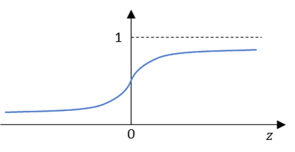

$$
\begin{align*}
g(z)&=\frac{1}{1+e^{-z}}\\
h_\theta(x)&=\frac{1}{1+e^{-\theta^Tx}}
\end{align*}
$$

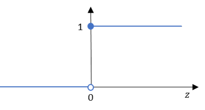

$$
\begin{align*}
g(z)&=\left\{\begin{matrix}
1 & (z\geq 0) \\
0 & (z>0)
\end{matrix}\right.\\
h_\theta(x)&=g(\theta^Tx)
\end{align*}
$$

이제 간단한 퍼셉트론 모델을 학습해보겠습니다.

어떠한 데이터 포인트가 원인지 사각형인지를 구별하는 모델 $\theta$가 있다고 가정해봅시다.

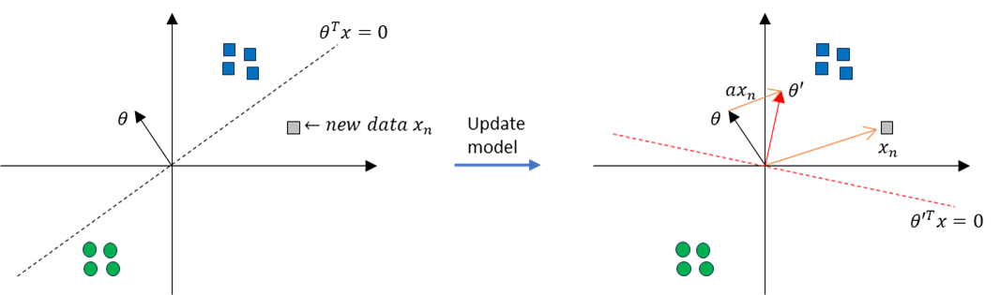

새로운 데이터 $x_n$이 주어졌을 때, 현재의 모델 $\theta$는 $x_n$을 올바르게 구별하지 못합니다.
따라서 우리는 새로운 데이터를 학습한 모델 $\theta'$를 얻어야 하고,
이것은 아래의 방식으로 구할 수 있습니다.

$$
\theta':=\theta+\alpha x
$$

이제 새로운 모델 $\theta'$는 데이터 포인트를 올바르게 분류할 수 있을 것입니다.

더 일반적인 표현으로 정리하면,  
다시, 우리의 목적은 2개의 다른 클래스를 잘 분류해내는 $\theta$를 찾는 것이 목적입니다.
이러한 목적은 아래의 수식으로 나타낼 수 있습니다.

$$
\theta_j:=\theta_j+\alpha (y^{(i)}-h_\theta(x^{(i)}))x^{(i)}_j
$$

여기서 $\alpha$는 학습률(learning rate)을 의미합니다.

만약 $y^{(i)}-h_\theta(x^{(i)})$가  
0이라면, 알고리즘이 잘 맞춘 것입니다.  
$+1$이라면, $y^{(i)}=1$일 때 알고리즘이 틀린 것입니다.  
$-1$이라면, $y^{(i)}=0$일 때 알고리즘이 틀린 것입니다.

하지만 현업에서는 perceptron을 사용하지 않습니다.
아래와 같은 XOR 문제는 못 풀기 때문입니다.

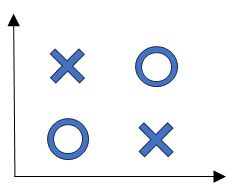

그리고 perceptron으로 XOR 문제를 해결해보자는 시도로 고안된게 바로 다층 퍼셉트론(multi layer perceptron),
현재의 신경망(neural network)입니다.

# Exponential family

지수족(exponential family)는 아래와 같은 형태로 표현될 수 있는 분포를 의미합니다.

$$
p(y;\eta)=b(y)\exp{(\eta^TT(y)-a(\eta))}
$$

여기서 $y$는 데이터,
$\eta$는 natural parameter,
$T(y)$는 sufficient statistic,
$b(y)$는 base measure,
$a(\eta)$는 log-partition입니다.

그리고 $e^{a(\eta)}$는 각각의 canonical parameter와 natural parameter 사이의 확률분포 맵핑을 정규화해주는 상수입니다.
따라서 확률분포가 항상 1이 되도록 보장합니다.

$$
p(y;\eta)=\frac{b(y)\exp{(\eta^TT(y))}}{e^{a(\eta)}}
$$

이제 예시를 몇개 보겠습니다.

* Bernoulli (binary data)

만약 어떠한 시행(trial)이 두 가지의 가능한 결과만을 갖고(사건이 발생했다 or 발생하지 않았다),
사건의 확률을 $\phi$로 정의할 때, Bernoulli 확률분포는 아래와 같이 나타낼 수 있습니다.

$$
p(y;\phi)=\phi^y(1-\phi)^{(1-y)}
$$

이제 여기에 $\log$와 $\exp$를 차례로 취해주면,
지수족의 수식의 형태로 변환할 수 있습니다.

$$
\begin{align*}
p(y;\phi)&=\phi^y(1-\phi)^{(1-y)}\\
&=\exp{\left(\log{\left(\phi^y(1-\phi)^{(1-y)}\right)}\right)}\\
&=1\cdot\exp{\left[\log{\left(\frac{\phi}{1-\phi}\right)\cdot y+\log(1-\phi)}\right]}
\end{align*}
$$

결과적으로 Bernoulli 분포 지수족의 각 인자는 아래와 같습니다.

$$
\begin{align*}
b(y)&=1\\
T(y)&=y\\
\eta&=\log{\left(\frac{\phi}{1-\phi}\right)}\Rightarrow\phi=\frac{1}{1+e^{-\eta}}\\
a(\eta)&=-\log(1-\phi)\Rightarrow -\log{\left(1-\frac{1}{1+e^{-\eta}}\right)}=\log{(1+e^\eta)}
\end{align*}
$$

* Gaussian (with fixed variance)

이제는 정규분포의 인자를 알아봅니다.
$\sigma^2=1$로 가정합니다.

$$
\begin{align*}
p(y;\mu)&=\frac{1}{\sqrt{2\pi}}\exp{\left(-\frac{(y-\mu)^2}{2}\right)}\\
&=\frac{1}{\sqrt{2\pi}}e^{-\frac{y^2}{2}}\exp{\left(\mu y-\frac{1}{2}\mu^2\right)}
\end{align*}
$$

결과적으로 Gaussian 분포 지수족의 각 인자는 아래와 같습니다.

$$
\begin{align*}
b(y)&=\frac{1}{\sqrt{2\pi}}e^{-\frac{y^2}{2}}\\
T(y)&=y\\
\eta&=\mu\\
a(\eta)&=\frac{\mu^2}{2}=\frac{\eta^2}{2}
\end{align*}
$$

우리가 이렇게 지수족을 사용하는 이유는,
이것이 꽤나 유용한 수학적 성질을 가지고 있기 때문입니다.

1. MLE (maximum likelihood estimation) with respect to $\eta\Rightarrow$ concave  
NLL (negative log likelihood) $\Rightarrow$ convex
2. $E(y;\eta)=\frac{\partial}{\partial\eta}a(\eta)$
3. $Var(y;\eta)=\frac{\partial^2}{\partial\eta^2}a(\eta)$

# Generalized linear model (GLM)

"선형 모델로 parameter들을 re-parameterize하여 GLM을 얻는다."

### Assumptions / Design choices
1. $y|x;\theta$ ~ Exponential Family $\eta$  
$\theta$에 의해 parameterize되고, x가 주어질 때의 y가 지수족에 속한다.  

2. $\eta=\theta^Tx$, where $\theta\in\mathbb{R}^n$, $x\in\mathbb{R}^n$  
선형 예측자 $\eta$는 입력 변수 $x$와 모델 파라미터 $\theta$의 선형 결합 형태이다.

3. Test time output $h_\theta(x)=E\left[y|x;\theta\right]$  
모델 예측은 지수족 확률분포의 기댓값(평균)이다.

이러한 가정에서, 우리는 데이터와 문제에 따라 지수족을 결정할 수 있습니다.  
가령 회귀 문제라면 $y$가 실수일 것이기에 Gaussian을 선택하고,
이진분류 문제라면 $y$가 Binary일 것이기에 Bernoulli를 선택하는 식입니다.

|                  Data                 |  Exponential family  |
|:-------------------------------------:|:--------------------:|
|                  Real                 |       Gaussian       |
|                 Binary                |       Bernoulli      |
|      Count (non negative integer)     |        Poisson       |
| $\mathbb{R}^+$ (positive real number) |  Gamma, Exponential  |
|              Distribution             |    Beta, Dirichlet   |

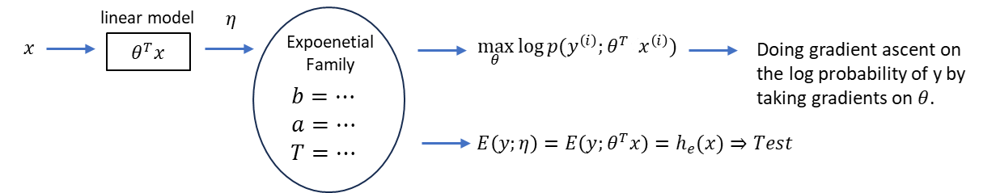

우리는 gradient descent로 선형모델 $\theta$를 훈련하고,
그 $\theta$가 주어졌을 때 $y$의 로그 확률에 대한 gradient ascent를 통해 일반화된 모델(exponential family distribution, exponential parameter)를 얻습니다.

Q: 지금 지수족 확률분포의 모수를 예측하도록 $\theta$를 학습하는 것인가요?
그리고 이 때, 해당 분포의 평균이 바로 우리가 원하는 예측 $y$인가요?  
A: 그렇습니다.

한가지 유의해야할 점은 우리가 gradient descent를 통해 학습하는 것은 모델의 파라미터($\theta$)이지,
분포의 파라미터($\mu, \sigma^2, \eta$)는 아니라는 점입니다.

### GLM training

GLM의 학습 과정은 아래와 같습니다.

|1| 선형 예측자와 natural parameter 계산

선형 예측자 $\eta$는 모델 파라미터 $\theta$와 입력 변수 $x$의 선형 결합으로 계산됩니다.

$$
\eta=\theta^Tx
$$

만약, canonical link function을 사용한다면 $\eta$가 natural parameter가 됩니다.

|2| 예측된 평균 $\mu$ 구하기

지수족 분포의 성질에 의해 log-partition 함수 $a(\eta)$의 미분은 $y$의 기대값과 연결됩니다.

$$
\mu=E[T(y)]=\nabla a(\eta)
$$

만약 $T(y)=y$인 경우,

$$
\mu=\frac{\partial}{\partial\eta}a(\eta)
$$

즉, 모델은 선형 예측자 $\eta$를 바탕으로 $\mu$를 예측하며,
이 $\mu$는 우리가 찾는 반응 변수 $y$의 기댓값(평균)입니다.

|3| Likelihood와 파라미터 추정

전체 데이터에 대한 likelihood는

$$
L(\theta)=\prod^{n}_{i=1}p(y_i;\eta_i)
$$

이고, log likelihood는 아래와 같습니다.

$$
l(\theta)=\sum^{n}_{i=1}\left[\eta^T_iT(y_i)-a(\eta_i)+\ln b(y_i)\right]
$$

이제 데이터에 대한 log likelihood를 최대화하는 $\theta$를 찾습니다.
Gradient descent 등을 이용하여 파라미터 $\theta$를 업데이트합니다.

학습 수식은 아래와 같습니다.

$$
\theta_j:=\theta_j+\alpha\left[y^{(i)}-h_\theta(x^{(i)})\right]x^{(i)}_j
$$

이 업데이트 규칙은 우리가 하는 것이 분류, 회귀, Poisson 회귀문제냐에 상관없이 항상 동일합니다.
또한, 만약 특징 개수가 1,000개 미만이라면 Netwon's method도 사용할 수 있습니다.

### GLM inferencing

학습이 완료되면, 새로운 입력 $x_{new}$가 주어졌을 때 $y$에 대한 예측을 수행합니다.

|1| 선형 예측차 계산

새로운 입력 $x_{new}$에 대해 선형 예측자를 계산합니다.

$$
\eta_{new}=\theta^Tx_{new}
$$

|2| 예측된 평균 계산

학습된 모델에서 log-partition 함수 $a(\eta)$의 미분을 사용해 새로운 $\eta_{new}$에 대응하는 기댓값을 구합니다.

$$
\mu_{new}=\nabla a(\eta_{new})
$$

|3| 예측 분포 구성

최종적으로, 모델은 새로운 입력에 대해 아래의 형태로 예측 분포를 제공합니다.
이 분포를 통해 $y$의 기댓값 분산, 신뢰 구간 등도 추론할 수 있습니다.

$$
p(y_{new};\eta_{new})=b(y_{new})\exp{\left(\eta^T_{new}T(y_{new})-a(\eta_{new})\right)}
$$

### 3-parameterizations

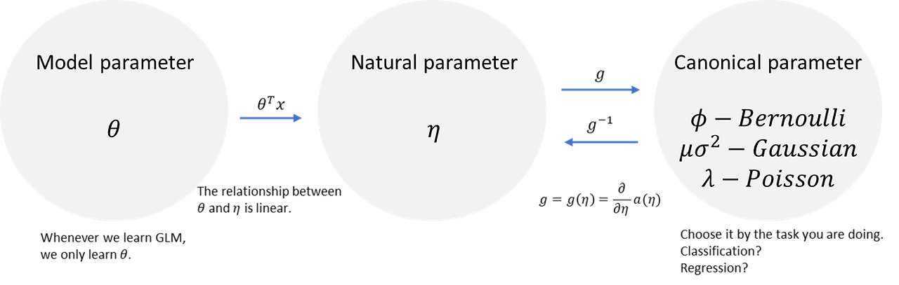

### Logistic regression

Logistic 회귀에서는 Bernoulli 분포를 선택합니다.

$$
h_\theta(x)=E[y|x;\theta=\phi=\frac{1}{1+e^{-\eta}}=\frac{1}{1+e^{-\theta^Tx}}
$$

Bernoulli를 $y$의 분포로 선택한다면, logistic 회귀가 자연스럽게 튀어나옵니다.

예전에 우리는 단지 $(-\infty,\infty)$의 범위를 갖는 예측 결과를 $(-1,1)$의 범위 내로 한정시키기 위해 sigmoid 함수를 사용했습니다.
그런데, GLM에서 sigmoid 함수가 나오는 걸 보니 sigmoid 함수를 선택하는 것이 당연한 것이었습니다.

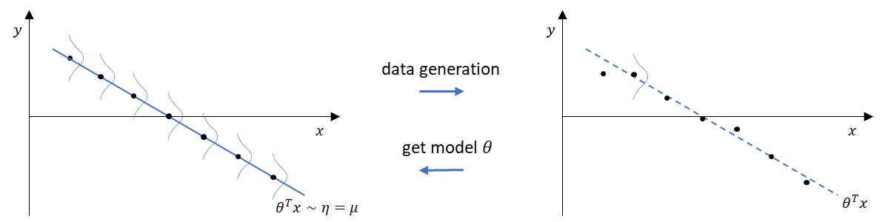

$\sigma^2=1$을 가정했을 때, 선 $\theta^Tx$는 특정 $x$에서 샘플링된 $y$ 값들의 평균값을 나타냅니다.

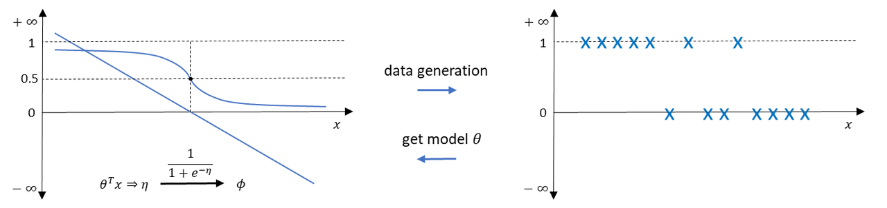

### Softmax regression

문제를 하나 소개합니다.  
모델은 어떠한 새로운 데이터가 주어졌을 때,
그것이 $\bigtriangleup$인지, $\bigcirc$인지, $\square$인지를 맞춰야 합니다.

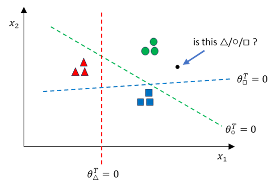

각각의 클래스는 각자의 파라미터 셋을 가집니다.

$$
\begin{bmatrix}
-\theta_{\bigtriangleup}-\\ 
-\theta_{\bigcirc}-\\
-\theta_{\square}-
\end{bmatrix} 
$$

이제 $x$가 주어지면, 우리의 모델은 $\theta^T_c$를 출력합니다.
이 값은 음수일수도, 양수일수도 있습니다.

우리는 확률값을 얻고 싶으므로 exponential을 취해주어 전부 양의 값을 갖도록 바꿔줍니다.

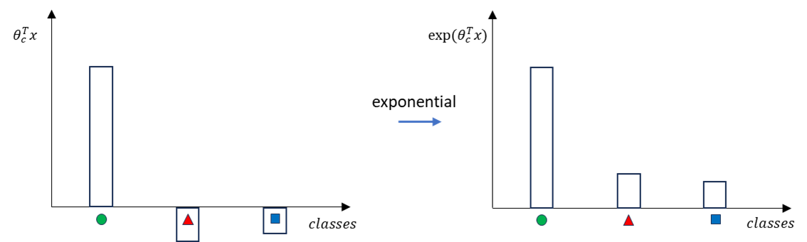

그리고 normalize해주어 전체 합이 1인 확률값을 얻습니다.

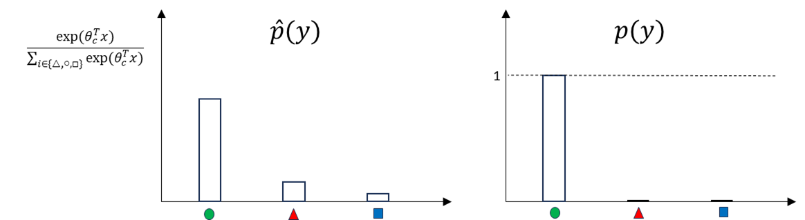

따라서, $x$가 주어졌을 때 우리는
1. $\theta^T_cx$를 구하고,
2. exponential을 취하고,
3. normalize를 합니다.

그러면 우리는 해당 데이터가 어느 클래스에 속해있을지에 대한 확률값을 얻게 됩니다.

우리는 모델 예측의 확률분포 $\hat{p}(y)$가 실제 클래스의 확률분포 $p(y)$와 비슷하기를 원합니다.
즉, 우리는 이 두 분포 사이의 cross entropy를 최소화할 필요가 있다는 말이 됩니다.

그러면 cross entropy를 마치 손실함수처럼 두고 gradient descent를 수행할 수 있습니다.

만약 해당 샘플이 $\bigtriangleup$ 클래스에 속한다면, 손실함수 계산은 아래와 같이 이루어집니다.

$$
\begin{align*}
CrossEntropy(p,\hat{p})&=-\sum_{y\in\{\bigtriangleup,\bigcirc,\square\}}p(y)\log \hat{p}(y)\\
&=-\log \hat{p}(y_{\bigtriangleup}\\
&=-\log \frac{e^{\theta^T_\bigtriangleup x}}{\sum_{c\in\{\bigtriangleup,\bigcirc,\square\}}e^{\theta^T_cx}}
\end{align*}
$$