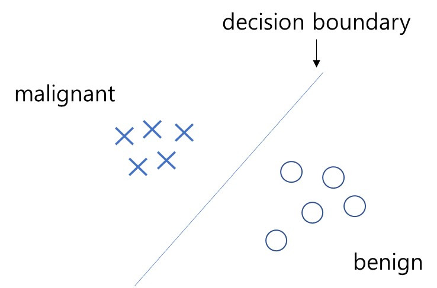
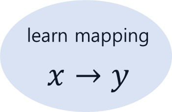
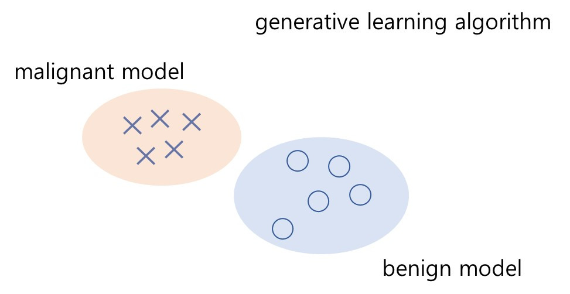
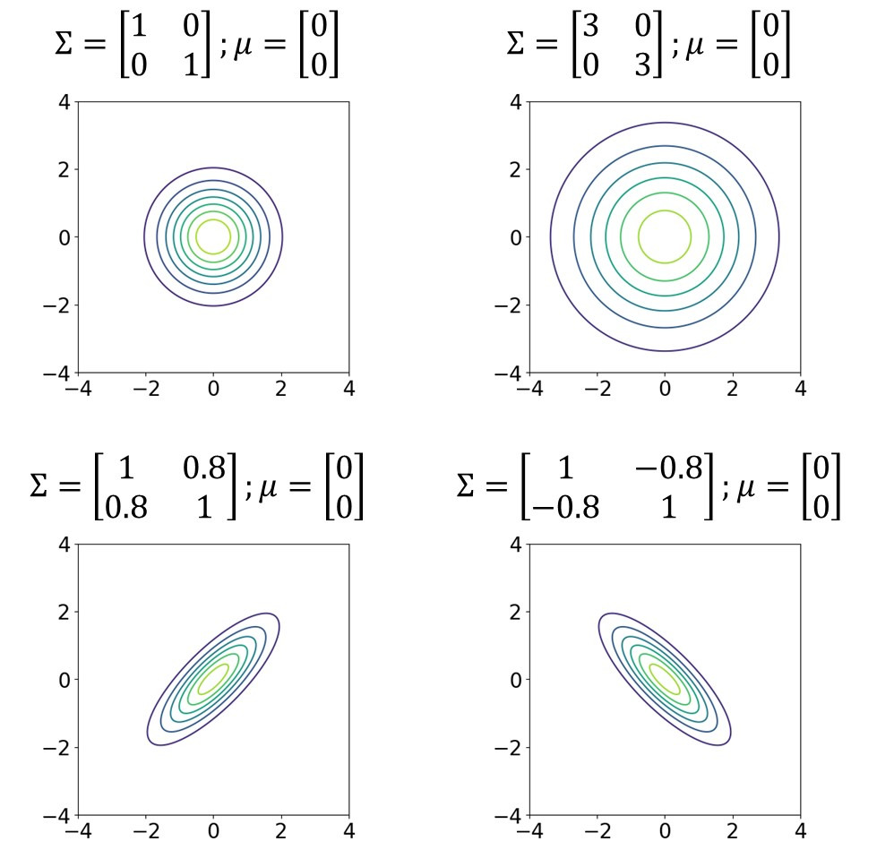
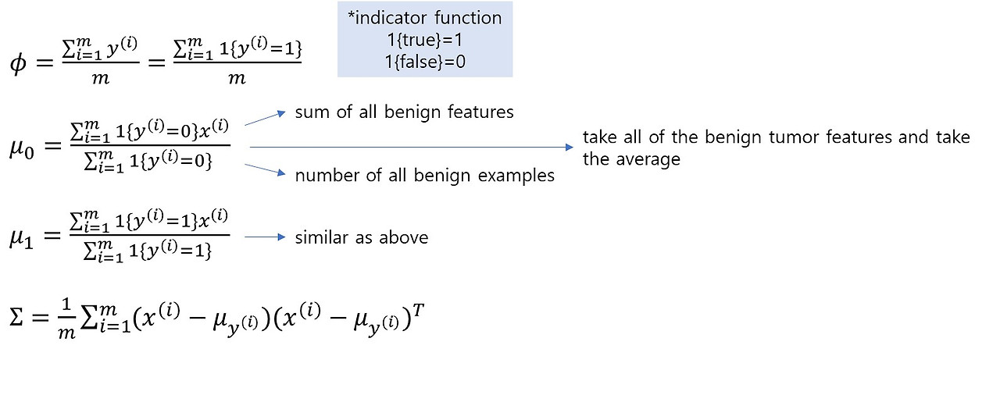
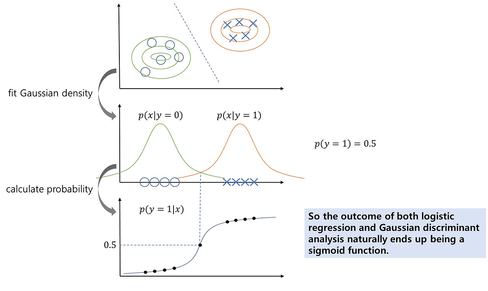
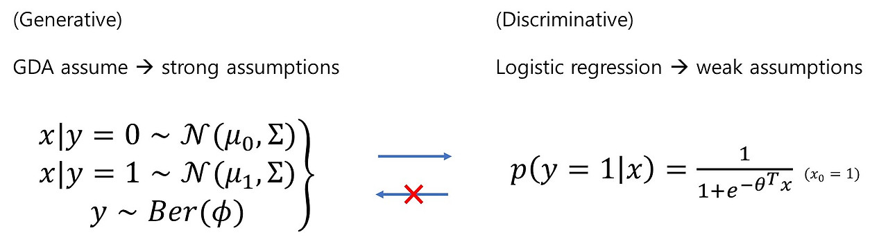

# 들어가기 앞서

본 시리즈의 목적은 CS229 강의 내용을 그대로 담아서 필자의 장기기억 저장소에 업로드하기 위함이므로,
강의 내용을 될 수 있는 한 그대로 따라가려고 합니다.
그래서 강의 흐름에 따라 강의자가 한 대사와 판서 내용을 그대로 적으려고 했습니다.
다만 흐름이 매끄럽지 못하거나 추가 설명이 필요하다 생각되는 부분은 필자가 강의자의 대사를 인용해서,
혹은 필자 나름대로의 생각을 추가하였습니다.
포스팅에서 강의 내용과 필자의 생각을 따로 구분하지는 않고 있으니, 이 점 염두에 두시고 읽어주시면 감사하겠습니다.

# Generative learning algorithm

### Descriminative learning algorithm

Logistic regression은 양성(malignant)이냐 음성(benign)이냐를 구분짓는 결정경계(decision boundary)를 탐색합니다.

이렇게 모델이 $x$에서 $y$로의 맵핑 $p(y|x)$ 
혹은 $h_\theta(x)=\left\{\begin{matrix}
0 & \\
1 &
\end{matrix}\right.$를 직접적으로 학습하는 경우를 'discriminative learning algorithm'이라고 부릅니다.

### Generative learning algorithm

양과 음의 데이터들을 모두 살펴보고 그들을 분류하는 방법을 찾는 discriminative learning algorithm과는 다르게,  
Generative learning algorithm은 각각의 클래스를 잘 설명하는 각각의 모델을 학습합니다.
그리고 추론 시에는 새로운 데이터를 양성 모델에 대해 평가하고 음성 모델에 대해서도 평가해서, 새 데이터가 두 모델 중 어느 것에 더 맞는지를 확인합니다.

Generative learning algorithm에서는 $p(x|x)$와 $p(y)$를 학습합니다.

$p(x|y)$는 클래스가 주어졌을 때 특징의 확률 분포를 뜻합니다.

$p(y)$는 클래스의 사전분포(prior)입니다.
Prior의 개념을 말로 풀어보면 이렇습니다.

 "환자가 병원에 걸어들어오고 있고, 아직 해당 환자를 조사한 적이 없다면, 그의 종양이 양성일 혹은 음성일 확률은 얼마인가?"

이제 $p(x|y)$와 $p(y)$를 학습했다면 *Bayes rule*을 통해,
$p(y=1|x)$를 구할 수 있습니다.

$$
p(x)=p(x|y=1)p(y=1)+p(x|y=0)p(y=0)
$$

$$
p(y=1|x)=\frac{p(x|y=1)p(y=1)}{p(x)}
$$

$p(y|x)$는 우리가 얻고자 하는 확률분포입니다.
이를 말로 풀어보면 이렇습니다.

"새로운 환자에 대한 데이터 $x$가 주어졌을 때, 해당 환자의 종양이 양성일 확률은 얼마인가?"

# Gaussian Discriminant Analysis (GDA)

$x\in\mathbb{R}^n$이고, 
$p(x|y)$가 정규분포임을 가정할 때,

$$
Z\sim N(\vec{\mu}, \Sigma) \\
(Z\in\mathbb{R}^n, \vec{\mu}\in\mathbb{R}^n, \Sigma\in\mathbb{R}^{n\times n})\\
$$

$$
E[Z]=\mu
$$

$$
\begin{align*}
Cov(Z)&=E[(Z-E[Z])(Z-E[Z])^T]\\
&=E[ZZ^T]-(E[Z])(E[Z])^T
\end{align*}
$$

$$
p(Z)=\frac{1}{(2\pi)^{\frac{n}{2}}|\Sigma|^{\frac{1}{2}}}\exp\left(-\frac{1}{2}(x-\mu)^T\Sigma^{-1}(-\mu)\right)
$$

2차원 가우시안 분포 시각화 예시)

# GDA Model

GDA 모델을 수식적으로 표현하면 아래와 같습니다.

음성모델

$$
p(x|y=0)=\frac{1}{(2\pi)^{\frac{n}{2}}|\Sigma|^{\frac{1}{2}}}\exp\left(-\frac{1}{2}(x-\mu_0)^T\Sigma^{-1}(-\mu_0)\right)
$$

양성모델

$$
p(x|y=1)=\frac{1}{(2\pi)^{\frac{n}{2}}|\Sigma|^{\frac{1}{2}}}\exp\left(-\frac{1}{2}(x-\mu_1)^T\Sigma^{-1}(-\mu_1)\right)
$$

Prior

$$
p(y)=\phi^y(1-\phi)^{(1-y)}\\
(p(y=1)=\phi)
$$

따라서 종양이 양성이거나 음성일 때의 특징 분포는 각각 다른 평균값 $\mu_0$, $\mu_1$을 갖고, 하나의 공분산 행렬 $\Sigma$을 공유합니다.

각각의 분산 파라미터 $\Sigma_0$, $\Sigma_1$를 사용할 수도 있지만, 일반적이지는 않습니다.
왜 우리가 하나의 공분산 행렬만을 사용하는지는 나중에 다루겠습니다.

결과적으로 GDA 모델에는 4가지 파라미터가 있습니다.

$$
\begin{align*}
\mu_0,\mu_1&\in\mathbb{R}^n\\
\Sigma&\in\mathbb{R}^{n\times n}\\
\phi&\in\mathbb{R} \leftarrow \text{real number between 0 and 1}
\end{align*}
$$

이제 훈련 데이터셋 $\left\{x^{(i)}, y^{(i)}\right\}^m_{i=1}$을 가지고 파라미터들을 학습해봅시다.

학습 방법은 바로 파라미터들에 대한 $x$와 $y$의 joint likelihood를 최대화하는 것입니다.

$$
\begin{align*}
L(\phi,\mu_0,\mu_1,\Sigma)&=\prod^m_{i=1}(x^{(i)},y^{(i)};\phi,\mu_0,\mu_1,\Sigma)\\
&=\prod^m_{i=1}p(x^{(i)}|y^{(i)})p(y^{(i)})
\end{align*}
$$

여기서도 log를 취해서, log likelihood를 구하는 문제로 바꿔주도록 합니다.

$$
l=\log L(...)
$$

$$
\max_{\phi,\mu_0,\mu_1,\Sigma}l(\phi,\mu_0,\mu_1,\Sigma)
$$

결과적으로, $\phi,\mu_0,\mu_1,\Sigma$의 maximum likelihood는 아래와 같습니다.

# GDA Prediction

파라미터 학습이 끝나면 새로운 데이터(환자)에 대한 예측을 수행합니다.

$$
\argmax_y=p(y|x)
$$

Bayes rule에 따라 이는 곧 아래와 같습니다.

$$
\argmax_y=\frac{p(x|y)p(y)}{p(x)}
$$

여기서 $p(y)$는 상수이므로 생략합니다.

$$
\argmax_y=p(x|y)p(y)
$$

Q: 왜 별개의 두 평균$\mu_0$와 $\mu_1$, 그리고 하나의 공분산 행렬 $\Sigma$를 사용하나요?  
A: 이런 식으로 모델을 설계하면, decision boundary가 선형의 형태를 띄게 됩니다. 그리고 대부분의 문제를 푸는 데는 선형의 decision boundary를 갖는 편이 좋습니다.

# Compare GDA to logistic regression

파라미터 $\phi,\mu_0,\mu_1,\Sigma$가 고정일 때,
$x$에 대한 함수 $p(y=1|x;\phi,\mu_0,\mu_1,\Sigma)$를 그려보면 아래와 같습니다.

즉, GDA나 logistic regression이나 결과는 똑같다는 겁니다.

Q: 그렇다면 언제 GDA를 사용하고 언제 Discriminative learning algorithm을 사용할까요? 언제 GDA가 더 유리하고, 언제 logistic regression이 더 유리할까요?  
A: 가정이 어떻느냐에 따라 다릅니다.

GDA 가정은 강하고 logistic regression 가정은 약합니다.
왜냐하면 GDA는 주어진 데이터가 정규분포임을 가정하고 있기 때문입니다.
(우리가 사는 세상에서 데이터가 정규분포를 띈다는 것은 거의 사실이 아닙니다.)

그리고 GDA 가정은 강하고 logistic regression 가정은 약하기 때문에 generative algorithm 가정으로 discriminative algorithm 가정을 증명할 수 있습니다.

당연하게도 반대 방향은 참이 아닙니다.
Logistic 함수로 $p(y=1|x)$를 가정했다 하더라도
$x|y=0$이나 $x|y=1$이 정규분포임은 가정할 수 없기 때문입니다.

만약 데이터가 정규분포를 띈다는 확신이 있고, 또 그것이 참이라면 GDA의 성능이 좋을 것입니다.

하지만 데이터가 정규분포를 띄지 않는다면, GDA보다는 logistic regression의 성능이 더 좋을 것입니다.