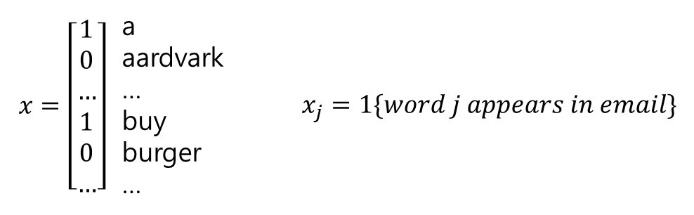
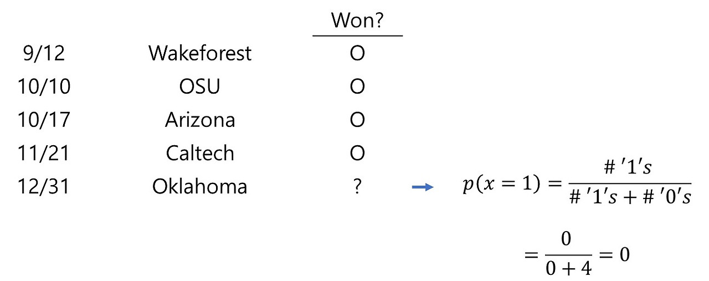
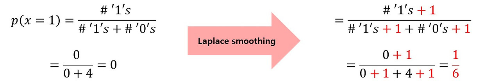
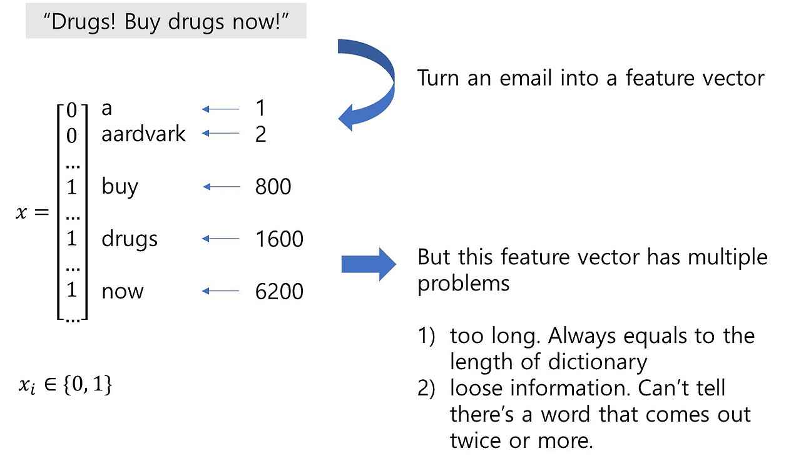
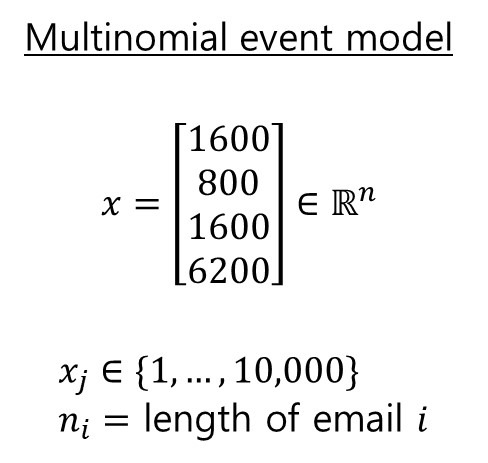
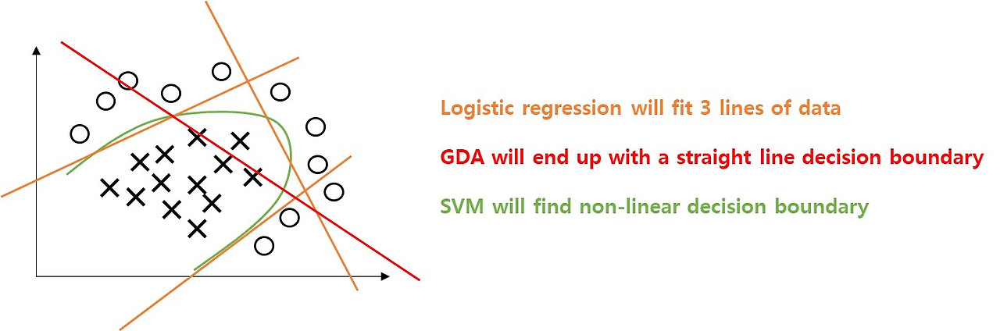
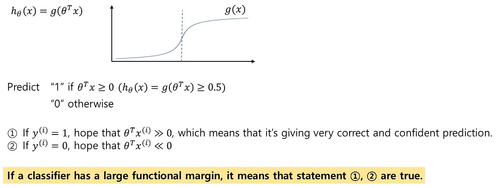
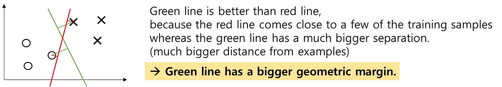
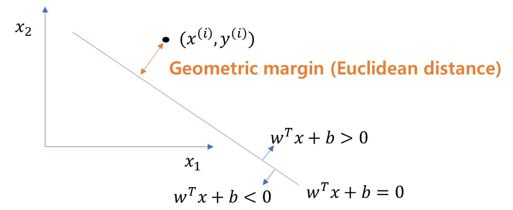

# 들어가기 앞서

본 시리즈의 목적은 CS229 강의 내용을 그대로 담아서 필자의 장기기억 저장소에 업로드하기 위함이므로,
강의 내용을 될 수 있는 한 그대로 따라가려고 합니다.
그래서 강의 흐름에 따라 강의자가 한 대사와 판서 내용을 그대로 적으려고 했습니다.
다만 흐름이 매끄럽지 못하거나 추가 설명이 필요하다 생각되는 부분은 필자가 강의자의 대사를 인용해서,
혹은 필자 나름대로의 생각을 추가하였습니다.
포스팅에서 강의 내용과 필자의 생각을 따로 구분하지는 않고 있으니, 이 점 염두에 두시고 읽어주시면 감사하겠습니다.

# 스팸 메일 필터링

Naive Bayes는 generative learning 알고리즘의 한 종류입니다.

이메일이나 트위터 등 텍스트가 주어졌을 때
단어로 이루어진 dictionary를 만들고,
해당 텍스트에 단어가 존재할 경우 1, 존재하지 않을 경우 0을 집어넣음으로써,
해당 텍스트가 스팸 메일인지 아닌지를 판별할 수 있습니다.

따라서 이 dictionary라 함은 결국 특징(feature representation)의 형태가 됩니다.

이것을 위한 generative 모델을 만들기 위해서는,
우리는 $p(x|y)$항과 $p(y)$항을 모델링해야 합니다.
(GDA에서 이 두 항은 각각 Gaussian과 Bernoulli 분포가 될 것입니다.)

Naive Bayes에서는 $p(x|y)$가 $y$에 대한 입력 $x$ 샘플들의 조건부확률을 곱한 것으로 모델링됩니다.

$$
p(x|y)=\prod^n_{j=1}p(x_j|y)
$$

따라서, Naive Bayes 모델의 파라미터는 아래와 같습니다.

$$
\begin{align*}
p(y=1)&=\phi_y \rightarrow \text{chance that y=1}\\
p(x_j=1|y=0)&=\phi_{j|y=0} \rightarrow \text{chance of word j appearing in a non-spam email}\\
p(x_j=1|y=1)&=\phi_{j|y=1} \rightarrow \text{chance of word j appearing in a spam email}
\end{align*}
$$

그리고 maximum likelihood estimate를 유도하면 아래와 같습니다.

$$
\phi_y=\frac{\sum^m_{i=1}1\{y^{(i)}=1\}}{m}
$$

$$
\phi_{j|y=0}=\frac{\sum^m_{i=1}1\{x^{(i)}_j=1,y^{(i)}=0\}}{\sum^m_{i=1}1\{y^{(i)}=0\}}
$$

새로운 메일이 들어왔을 때는 다음의 방식으로 추론을 진행합니다.

$$
p(y=1|x)=\frac{p(x|y=1)p(y=1)}{p(x|y=1)p(y=1)+p(x|y=0)p(y=0)}
$$

이렇게만 보면, 알고리즘이 잘 동작할 것 같아 보입니다.
하지만 여기에는 문제가 있습니다.

만약 'NIPS'라는 단어가 있고 이 단어는 10,000개 단어 dictionary에서 6017에 해당한다고 합시다.

$$
\text{NIPS}\rightarrow j=6017
$$

하지만 이 단어는 아마 우리 메일함에서는 본 적이 없던 단어일 것입니다.
보통 NIPS가 포함되어있는 이메일을 받을 일은 없죠.

그래서 확률은 0입니다.

$$
p(x_{6017}=1|y=1)=\frac{0}{1\{y=1\}}=0 \rightarrow\phi_{6017|y=1}\\
p(x_{6017}=1|y=0)=\frac{0}{1\{y=0\}}=0 \rightarrow\phi_{6017|y=0}
$$

하지만 통계적으로 이것은 좋은 생각이 아닙니다.
단지 당신이 그것을 본 적이 없다고 해서 그것이 발생할 확률이 0이라니요.
그래서 Naive Bayes 알고리즘 또한 통계적으로 타당하지 않게 됩니다.

이제 이 NIPS 케이스에 대한 모델 추론값을 구해보자면,

$$
p(x|y=1)=\prod^{10,000}_{y=1}p(x_i|y=1)
$$

그리고 NIPS를 이전에는 본 적이 없으므로,

$$
p(x_{6017}|y=1)=0
$$

그리고 0과의 곱은 항상 0이므로,

$$
p(x|y=1)=0
$$

결과적으로 NIPS 단어를 포함하는 새로운 메일이 스팸일 확률은 '계산불가'가 됩니다.

$$
p(y=1|x)=\frac{0}{0+0}
$$

분모가 0이 되기 때문입니다.

### Laplace smoothing

이러한 문제를 해결하기 위해 Laplace smoothing 기법이 사용됩니다.

여기 스탠포드 대학 풋볼 팀의 점수판이 있습니다.  
이들이 다음 오클라호마와의 경기에서 승리할 확률은 얼마나 될까요?  
(Won? 컬럼의 'O' 표기는 졌다는 것을 의미합니다.)

역대 전적을 보아하니, 이들은 한번도 이기지 못했습니다.
그래서 간단히 생각하면 0입니다.
하지만 단지 한번도 이겨본 적이 없다는 이유로 이들이 앞으로도 절대 이기지 못할 것이라고 말하는 것은 불합리합니다.

그래서 Laplace smoothing을 진행합니다.
각각의 사건에 1을 더해줍니다.
이러는 편이 더 합리적으로 보입니다.

따라서 더 일반적으로는,

$$
x\in\{1,...,k\}
$$

추정

$$
p(y=1)=\frac{\sum^m_{j=1}1\{x^{(i)}=j\}+1}{m+k}
$$

결과적으로

$$
\phi_{j|y=0}=\frac{\sum^m_{i=1}1\{x^{(i)}_j=1,y^{(i)}=0\}+1}{\sum^m_{i=1}1\{y^{(i)}=0\}+2}
$$

다시 한번 정리하면 아래와 같습니다.

이제 스탠포드 풋볼팀이 오클라호마를 상태로 승리를 차지할 확률은 16.67%가 되었습니다!

# Multivariate Bernoulli event model

우리가 어떠한 문장을 dictionary 벡터로 맵핑하려고 할 때, 문제가 하나 발생합니다.

이렇게 문장을 0과 1로 구성된 단어 dictionary로 맵핑할 경우,
특징 벡터가 너무 길어지고, 문장에 단어가 몇개가 포함되어있는지, 단어가 어디서 나타나는 지 등의 정보를 잃게 됩니다.

여기 새로운 표현방식이 있습니다.

단어를 숫자로 맵핑하고(drug를 1600, buy를 800, now를 6200으로),
이 숫자들로 구성된 벡터로 문장을 표현하는 것입니다.

이제 maximum likelihood estimation을 하면 다음과 같습니다.

$$
\phi_{k|y=0}=\frac{\sum^m_{i=1}1\{y^{(i)}=0\}\sum^{n_i}_{j=1}1\{x^{(i)}_j=k\}+1(\text{for Laplace smoothing})}{\sum^m_{i=1}1\{y^{(i)}=0\}\cdot n_i+10,000(\text{for Laplace smoothing})}
$$

결과적으로,

스팸이 아닌 이메일에 어떠한 단어(가령 'drug')가 포함되어있을 확률은 얼마나 되는가?

$$
\phi_{j|y=0}
$$

메일함에 있는 모든 스팸이 아닌 이메일의 단어들을 보았을 때,
'drug'의 비율은 얼마나 되는가?

$$
\phi_y
$$

를 구하는 것입니다.

Naive Bayes는 logistic regression이나 SVM처럼 아주 정확하지는 않지만,
계산적으로 효율적이고 구현이 빠르다는 장점이 있습니다.

# Support Vector Machines

SVM은 비선형의 decision boundary를 찾아주는 알고리즘입니다.

Logistic regression 방식으로 비선형 decision boundary를 얻고 싶다면,
그 방법 중에 특징 벡터 $x_1$, $x_2$를 가지고 고차원의 특징 벡터를 만드는 방식이 있습니다.

$$
\text{original feature vector}=
\begin{bmatrix}
x_1\\ 
x_2
\end{bmatrix} 
$$

$$
\text{augmented feature vector}=
\begin{bmatrix}
x_1\\ 
x_2\\
x^2_1\\
x^2_2\\
x_1x_2\\
...
\end{bmatrix} 
$$

이렇게 증강된 특징 벡터를 사용하면 logistic regression 모델이 비선형의 decision boundary를 학습할 수 있습니다.

하지만 이 특징들을 일일이 제작하기란 보통 쉬운 일이 아닙니다.

SVM을 사용하면, 입력 특징 $x_1$, $x_2$를 더 고차원의 특징셋으로 맵핑하는 알고리즘을 얻을 수 있습니다.

SVM은 신경망처럼 효과적이지는 않으나,
turn key 방식입니다.
모델러들이 parameter 다루는데 고생할 필요가 없습니다.

Support vector machine은 *optimal margin classifier*와 *kernel trick*의 종합판입니다.
따라서 이 두가지를 먼저 이야기해보도록 하겠습니다.

### Optimal margin classifier (seperable case)

* Functional margin  
정의: Functional margin은 분류기가 얼마나 정확하게 그리고 자신감있게 샘플을 분류하는가를 의미합니다.

이진분류 문제에서 logistic regression은 이렇게 생겼습니다.

* Geometric margin

따라서 SVM이 하는 가장 기본적인 일은 이러한 샘플을 분류하는 초록색 선을 찾는 최적화 문제를 제시하는 것입니다.

더 깊이 들어가기 전에, 간단히 정의를 살펴보고 갑니다.

이제부터 라벨 $y$는 -1 혹은 1 값을 가집니다.

$$
y\in\{-1,+1\}
$$

따라서 출력값 $h$ 역시 -1 혹은 1 값을 가집니다.

$$
g(z)=1 \text{   if   } z\geq0, -1\text{    otherwise}
$$

이제 

초평면(hyperplane)의 functional margin은 다음과 같이 정의됩니다.

$$
(w,b) \text{ with respect to } (x^{(i)},y^{(i)})
$$

하나의 훈련 샘플에 대한 functional margin은 아래와 같습니다.

$$
\hat{\gamma}^{(i)}=y^{(i)}(w^Tx^{(i)}+b)
$$

이 때,

$y^{(i)}=1$이라면, $w^Tx^{(i)}+b\gg0$이기를 원하고,  
$y^{(i)}=-1$이라면, $w^Tx^{(i)}+b\ll0$이기를 원합니다.

또한 $\hat{\gamma}^{(i)}\gg0$이기를 원합니다.

$\hat{\gamma}^{(i)}>0$이라면, $h(x^{(i)})=y^{(i)}$를 의미합니다.

전체 학습 샘플에 대한 functional margin은 아래와 같습니다.

$$
\hat{\gamma}=\min_i\hat{\gamma}^{(i)}\ \ \ (i=1,...,m)
$$

이 말인즉, 전체 학습 샘플에 대한 functional margin은 가장 작은 functional margin 값을 갖는 하나의 훈련 샘플에 의해 결정된다는 소리입니다.

위에서 언급했다시피, functional margin이 클수록, 분류 성능도 좋아집니다.

그래서 어떻게 $\hat{\gamma}$를 최대화시킬 수 있을까요?

간단하게는 파라미터 $(w,b)$를 최대화시키는 것을 생각할 수 있겠습니다.
하지만 이것은 아무 의미가 없는 행동입니다. Decision boundary가 전혀 바뀌지 않기 때문입니다.

그래서 파라미터가 커지는 것을 막아야 합니다.

그 방법은 파라미터들을 크기로 나누어주는 리스케일링을 수행하면 됩니다.

$$
||w||\rightarrow\text{Euclildean length of } w
$$

$$
(w,b)\rightarrow(\frac{w}{||w||},\frac{b}{||b||})
$$

그리고 바로 이것이 geometric margin입니다.

이제 하나의 훈련 샘플에 대해 geometric margin을 정의해봅시다.

$(x^{(i)},y^{(i)})$에 대한 초평면 $(w,b)$의 geometric margin은 다음과 같이 정의됩니다.

$$
\gamma^{(i)}=\frac{y^{(i)}(w^Tx^{(i)}+b)}{||w||}
$$

$$
\gamma^{(i)}=\frac{\hat{\gamma}^{(i)}}{||w||}
$$

훈련 데이터셋에 대한 geometric은 아래와 같습니다.

$$
\gamma=\min_i\gamma^{(i)}
$$

결과적으로, 이제 우리에게는 $\gamma$를 최대화하는 일만이 남았습니다.

Optimal margin classifier:  
$\gamma$를 최대화하는 $w$, $b$를 찾습니다.

$$
\max_{\gamma,w,b}\gamma\\
s.t.\ \frac{y^{(i)}(w^Tx^{(i)}+b)}{||w||}\geq\gamma\ \ \ (i=1,...,m)
$$

$$
\min_{w,b}||w||^2\\
s.t.\ y^{(i)}(w^Tx^{(i)}+b)\geq1
$$
